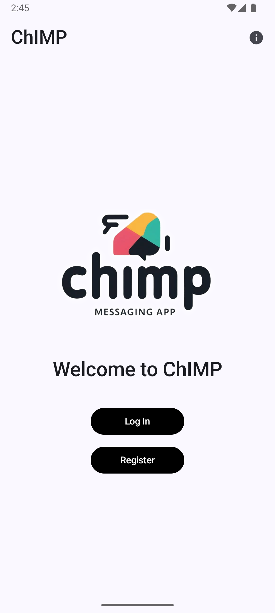
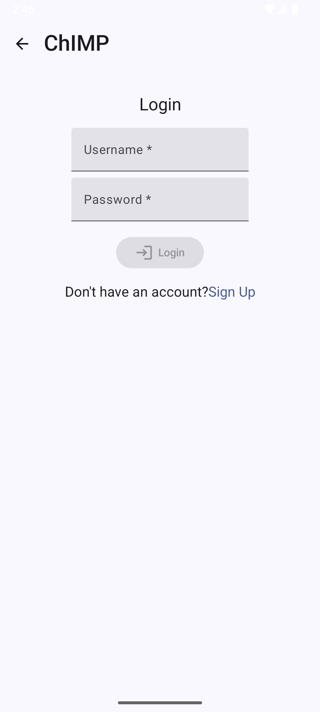
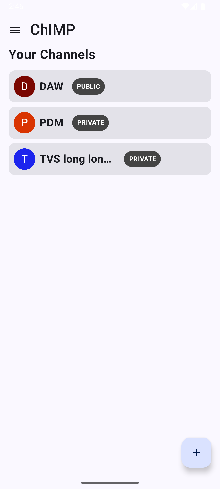
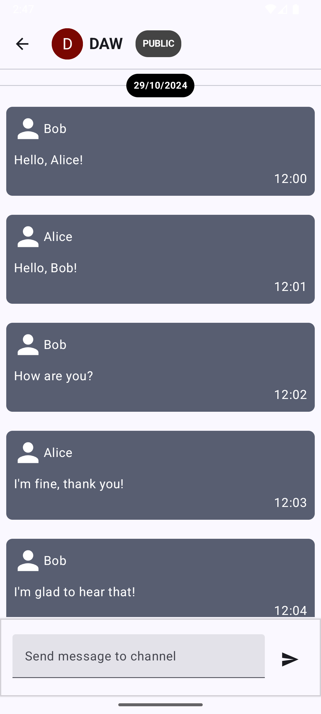
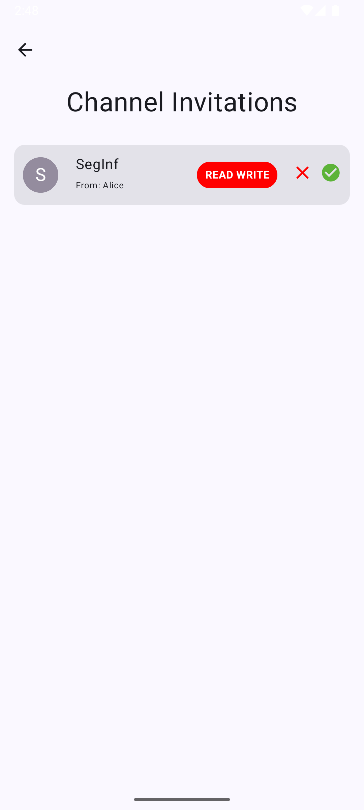
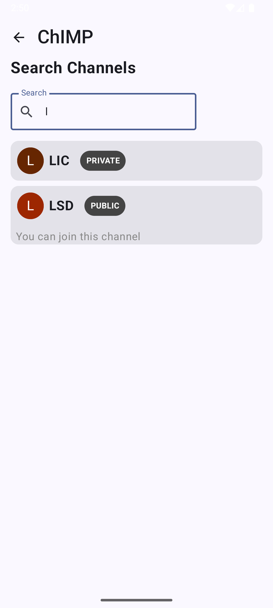

# ChImp APP

**ChImp** is an instant messaging application designed to offer **real-time communication**

The demo of the application can be found [here](https://www.youtube.com/watch?v=REzTkMhVgWw).

For more information about the application, see the [documentation](docs/README.md).

## Functionalities

- **User Authentication**:
  - Login, registration, and secure session management.
  - Token-based authentication with cookies for session persistence.

- **Messaging Channels**:
  - Real-time messaging using Server-Sent Events (SSE).
  - Support for multiple channels.
  - Access to previous messages received, even when offline.

- **Profile Management**:
  - View and edit user profiles.

- **Invitation Management**:
  - View and accept/reject pending invitations to channels.

- **Notifications**
  - Real-time notifications for new messages and invitations.

## Screenshots

Here are some screenshots of the application screens:

    
    
    

    
    
    
     

The application is implemented using Android with Kotlin. It is a client-server application, where
the server is implemented in Kotlin using the Spring framework.

## Technologies

- [Kotlin](https://kotlinlang.org/)
- [Compose](https://developer.android.com/develop/ui/compose?hl=en)
- [Material3](https://developer.android.com/jetpack/androidx/releases/compose-material3?hl=en)
- [Room Database](https://developer.android.com/training/data-storage/room)
- [ViewModel](https://developer.android.com/topic/libraries/architecture/viewmodel?hl=en)
- [StateFlow](https://developer.android.com/kotlin/flow/stateflow-and-sharedflow?hl=en)
- [Repository Pattern](https://developer.android.com/topic/architecture/data-layer?hl=en)
- [Ktor client](https://ktor.io/docs/client-create-and-configure.html)
- [Preferences Datastore](https://developer.android.com/topic/libraries/architecture/datastore)
- [WorkManager](https://developer.android.com/topic/libraries/architecture/workmanager)

## Authors

- Gonçalo Ribeiro
- João Marques
- Tiago Silva

 Professor: Eng. Paulo Pereira

@ISEL 
Bachelor in Computer Science and Computer Engineering 
Mobile Devices Programming - LEIC53D - Group 15 
Winter Semester of 2024/2025
